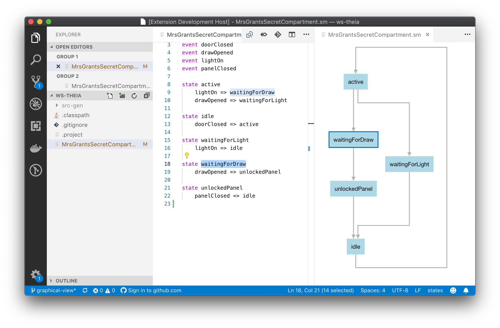
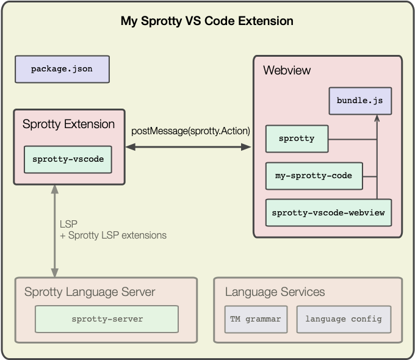

[](https://gitpod.io/#https://github.com/eclipse/sprotty-vscode) 

# sprotty-vscode

This repository contains the glue code to integrate [Sprotty diagrams](https://github.com/eclipse/sprotty) - with or without a language server - in VSCode extensions.

Also contains an example extension for a domain-specific language for statemachines. The example is also available as _States Example_ from the [VS Code Marketplace](https://marketplace.visualstudio.com/items?itemName=typefox.states-extension).



## Features

* running Sprotty diagrams in VS Code webviews,
* SVG export (ALT-E), animated center selection (ALT-C) and fit to screen (ALT-F) actions,
* interaction with Sprotty-enhanced language servers to automatically synchronize diagrams with language artifacts.

## Architecture

In VS Code, extensions can contribute new UI components using a webview. Webviews communicate with the extension using the [`postMessage`](https://code.visualstudio.com/api/extension-guides/webview#passing-messages-from-an-extension-to-a-webview) API. The [`WebviewPanelManager`](./packages/sprotty-vscode/src/webview-panel-manager.ts) uses this to send and receive Sprotty Actions to and from a [`WebviewEndpoint`](./packages/sprotty-vscode/src/webview-endpoint.ts). The latter runs a webpacked `bundle.js` that contains the Sprotty diagram code.



If your extension provides a language, you can include a [Sprotty-enhanced language server](https://github.com/eclipse/sprotty-server) to get fully synchronized diagrams for your language artifacts. The [`SprottyLspVscodeExtension`](./packages/sprotty-vscode/src/lsp/sprotty-lsp-vscode-extension.ts) acts as a relay between the language server and a [`SprottyLanguageWebview`](./packages/sprotty-vscode/src/lsp/sprotty-lsp-webview.ts), and intercepts actions/LSP messages that require to interact with the VS Code workbench.

## Contents

The repo is structured as follows
- `example/`: an example using an Xtext-based Language Server and with Sprotty visualization.
- `sprotty-vscode-extension/`: library code for the VSCode extension.
- `sprotty-vscode-protocol/`: common protocol classes for the communication between the extension and the webview.
- `sprotty-vscode-webview/`: library code for the script that is run in the webview.

## Development

Compile the library code and the examples
```
examples/states-xtext/language-server/gradlew -p examples/states-xtext/language-server/ build && yarn
```

