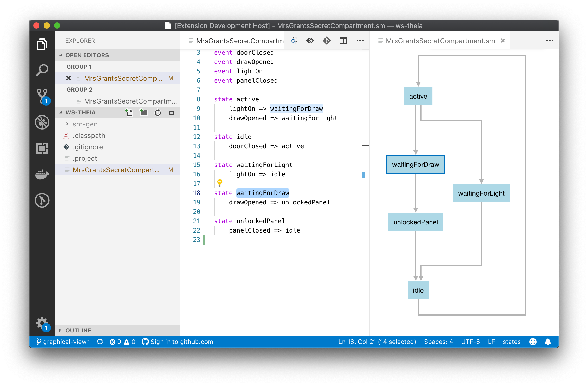
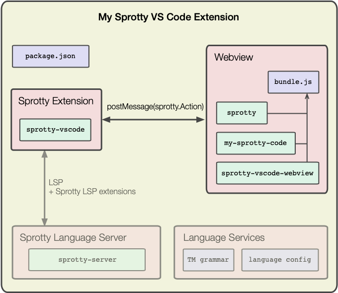

[](https://gitpod.io/#https://github.com/eclipse-sprotty/sprotty-vscode)

# sprotty-vscode

This repository contains the glue code to integrate [Sprotty diagrams](https://github.com/eclipse-sprotty/sprotty) - with or without a language server - in VSCode extensions.

Also contains an example extension for a domain-specific language for statemachines. The example is also available as _States Example_ from the [VS Code Marketplace](https://marketplace.visualstudio.com/items?itemName=typefox.states-extension).



## Features

* running Sprotty diagrams in VS Code webviews,
* SVG export (ALT-E), animated center selection (ALT-C) and fit to screen (ALT-F) actions,
* interaction with Sprotty-enhanced language servers to automatically synchronize diagrams with language artifacts.

## Architecture

In VS Code, extensions can contribute new UI components using a webview. Webviews communicate with the extension using the [`vscode-messenger`](https://github.com/TypeFox/vscode-messenger) library. A [`WebviewEndpoint`](./packages/sprotty-vscode/src/webview-endpoint.ts) uses this to send and receive Sprotty Actions to and from the webview, which runs a bundled script containing the Sprotty diagram code. Webview lifecycles are managed by one of three integration classes: [`WebviewPanelManager`](./packages/sprotty-vscode/src/webview-panel-manager.ts) (freestyle panels), [`SprottyEditorProvider`](./packages/sprotty-vscode/src/sprotty-editor-provider.ts) (custom editors), or [`SprottyViewProvider`](./packages/sprotty-vscode/src/sprotty-view-provider.ts) (webview views).



If your extension provides a language, you can include a Sprotty-enhanced language server — for example one built with [langium-sprotty](https://github.com/eclipse-langium/langium/tree/main/packages/langium-sprotty) — to get fully synchronized diagrams for your language artifacts. The `Lsp` variants of the classes above (e.g. [`LspWebviewPanelManager`](./packages/sprotty-vscode/src/lsp/lsp-webview-panel-manager.ts)) relay Sprotty Actions between the language server and the webview, and intercept actions/LSP messages that require interaction with the VS Code workbench. See [`docs/ARCHITECTURE.md`](./docs/ARCHITECTURE.md) for details.

## Contents

The repo is structured as follows
- `examples`: an example Sprotty visualization using a [Langium](https://langium.org/)-based Language Server.
- `packages/sprotty-vscode`: library code for the VSCode extension.
- `packages/sprotty-vscode-protocol`: common protocol classes for the communication between the extension and the webview.
- `packages/sprotty-vscode-webview`: library code for the script that is run in the webview.

## Development

Compile the library code and the examples:
```
yarn
```

Then launch the States example with one of the launch configurations in VS Code (F5). See [`AGENTS.md`](./AGENTS.md) for the full command surface.
